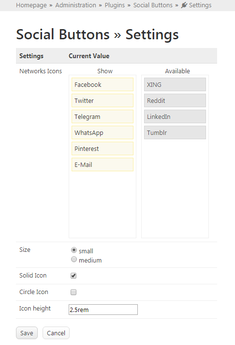

# [Social Buttons](https://github.com/mahotilo/SocialButtons) - Social Media Sharing Buttons Gadget for Typesetter CMS

## About
Super fast and easy Social Media Sharing Buttons. No JavaScript. No tracking.
Based on [Sharingbuttons.io](https://sharingbuttons.io)

## See also 
* [Typesetter Home](http://www.typesettercms.com)
* [Typesetter on GitHub](https://github.com/Typesetter/Typesetter)

## Current Version 
1.0

## Requirements
* Typesetter CMS

## Manual Installation
1. Download the [master ZIP archive](https://github.com/mahotilo/SocialButtons/archive/master.zip)
2. Upload the extracted folder 'SocialButtons-master' to your server into the /addons directory
3. Install using Typesetter's Admin Toolbox &rarr; Plugins &rarr; Manage &rarr; Available &rarr; SocialButtons

## Available Networks
* Facebook
* Twitter
* Telegram
* WhatsApp
* Pinterest
* Tumblr
* LinkedIn
* Reddit
* XING

and
* E-Mail
 
## Demo
### Buttons on the page

### Admin settings page

## License
GPL 2, for bundled thirdparty components see the respective subdirectories.
